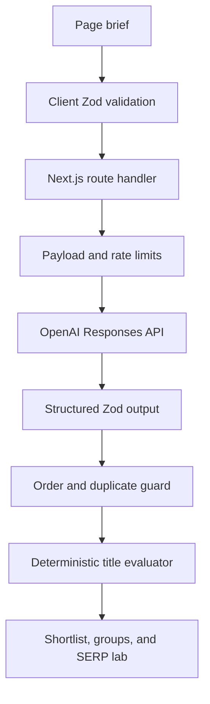

# AI Meta Title Generator v1 — Architecture and Integration Guide

## Product outcome

This vertical slice turns the meta-title methodology on Do It With AI Tools into an interactive editorial system. It is intentionally not a generic “keyword in, list out” generator.

The user receives:

1. a short natural-language analysis of the page brief;
2. four strategic groups—Unified, Search Engine, Human, and AI-readable;
3. five distinct candidates per group;
4. a deterministic top-three shortlist with explanations and trade-offs;
5. exact character counts and browser-measured pixel estimates;
6. mobile and desktop SERP previews;
7. keyword-placement, duplicate-risk, and quality checks; and
8. a live final editor that keeps human judgment in the loop.

“AI-readable” is deliberately framed as explicit context and answer alignment. The interface never guarantees an AI citation, ranking, click, or exact Google display.

## Reusable system architecture

```text
app/
├── ai-seo/meta-title-generator/page.tsx        # SEO landing page + structured data
└── api/ai-tools/meta-title/route.ts             # validated, protected server endpoint

components/ai-tools/
├── CopyButton.tsx                               # shared across every future generator
├── FormField.tsx                                # shared label/hint/error contract
└── ScoreRing.tsx                                # shared score visualization

features/meta-title-generator/
├── api.ts                                       # typed browser API client
├── config.ts                                    # limits and lens configuration
├── evaluator.ts                                 # deterministic title analysis
├── prompt.ts                                    # server-side editorial methodology
├── schema.ts                                    # one Zod source for input/output/types
├── types.ts                                     # evaluated client candidate type
└── components/
    ├── MetaTitleForm.tsx                        # progressive page brief
    ├── MetaTitleGeneratorClient.tsx             # request state and orchestration
    ├── MetaTitleResults.tsx                     # analysis + grouped results
    ├── SerpSimulator.tsx                        # live editor and device previews
    ├── TitleCard.tsx                            # reusable candidate interaction
    ├── ToolEducation.tsx                        # indexable supporting page content
    └── TopRecommendations.tsx                   # fixed editorial shortlist

lib/ai-tools/
├── openai.ts                                    # server-only provider and model routing
└── rate-limit.ts                                # Redis production limit + dev fallback
```

## Request flow



The model performs language and editorial ideation. Application code performs deterministic tasks:

- character counting;
- browser canvas pixel measurement;
- mobile and desktop threshold comparisons;
- exact keyword detection and position;
- duplicate similarity;
- simple stuffing, all-caps, punctuation, and clickbait checks;
- per-lens heuristic scores; and
- top-three ranking.

That boundary is the most important reusable engineering decision in the build.

## Reuse path for the future tool suite

| Layer                          | Meta title v1                         | Future use                                       |
| ------------------------------ | ------------------------------------- | ------------------------------------------------ |
| Page shell and content pattern | Tool + methodology + FAQ              | Meta description, H1, slug, outline, schema      |
| `FormField`                    | Brief inputs                          | Every generator form                             |
| `CopyButton`                   | Candidate and final title             | Any text or code output                          |
| `ScoreRing`                    | Lens score                            | Quality or completeness scores                   |
| API client pattern             | Typed POST and safe error             | Every tool endpoint                              |
| Zod structured output          | Five groups and analysis              | Tool-specific result contracts                   |
| Provider module                | GPT-5.6 Luna default                  | Central model routing by complexity              |
| Rate limiter                   | Five daily / three burst              | Per-tool and account-wide budgets                |
| Prompt boundary                | Source data cannot issue instructions | Every public AI input surface                    |
| Deterministic evaluator        | Pixels, keyword, duplicates           | Length, schema validity, readability, slug rules |

For the next tool, create a new feature folder and API route while reusing `components/ai-tools` and `lib/ai-tools`. Do not copy the entire meta-title feature and rename strings.

## Generation contract

The route uses the official OpenAI JavaScript SDK, the Responses API, and Structured Outputs through `zodTextFormat`.

- Default model: `gpt-5.6-luna`
- Reasoning effort: `low`
- Maximum output: 6,500 tokens
- Web search: enabled as an optional tool so the model can check real title conventions for the page's topic before writing candidates; falls back to a tool-free retry if the configured model rejects the combined request
- Output groups: exactly five in a fixed order (`unified`, `search`, `human`, `ai`, `desktop`)
- Candidates: exactly five per group (25 total)
- Server checks: schema adherence, group order, and exact duplicate rejection

The default model is configurable through `OPENAI_META_TITLE_MODEL`, so a later evaluation can compare Luna with Terra without editing code.

## Safety, privacy, and abuse controls

- The OpenAI key remains server-side and is never exposed through a `NEXT_PUBLIC_` variable.
- The input is validated, trimmed, length-limited, and inserted as JSON source data.
- The system prompt tells the model not to follow instructions embedded in user content.
- The endpoint rejects payloads larger than 30 KB.
- Anonymous requests are limited by a hashed IP and user-agent identifier.
- Production should configure Upstash Redis so limits are shared across Vercel instances.
- Responses are sent with `Cache-Control: no-store`.
- Raw page briefs are not intentionally logged.
- API errors return safe public messages; full failures stay in server logs.

### Important repository security action

The inspected GitHub repository currently contains a tracked root `.env` file. This package does not read or include that file. Before deploying the generator, remove the file from version control, add `.env*` rules that preserve only safe examples, and rotate every credential that may ever have been committed. Removing the latest file alone does not remove secrets from Git history.

## Pixel measurement policy

Google does not publish a fixed character limit. It says title links may be truncated as needed to fit the device. This tool therefore uses:

- a preferred editorial range of 45–58 characters;
- a 60-character hard warning threshold;
- a conservative 555 px mobile target;
- a 600 px desktop target; and
- `CanvasRenderingContext2D.measureText()` using a 20 px Arial-like SERP font.

These are editing heuristics. Google can rewrite a title link and may use the title element, visible main title, headings, `og:title`, other prominent content, anchor text, or site data.

## SEO page architecture

The tool page is server-rendered around the client application and includes:

- unique Metadata API values and canonical URL;
- `WebApplication`, `BreadcrumbList`, and `FAQPage` JSON-LD;
- an indexable explanation of the five lenses (unified, search, human, ai, desktop);
- the checks built into the tool;
- a four-step workflow;
- limitations for pixels and AI citations;
- FAQs; and
- a contextual link to `/ai-seo/meta-title`.

The existing article should link back to `/ai-seo/meta-title-generator` with a visible, descriptive CTA. Generated results remain session state; the build does not create indexable result URLs.

## Analytics event plan

The code intentionally does not hardwire analytics calls into v1. Add these GA4 events through one shared adapter after the interaction names are approved:

| Event               | Trigger                    | Useful parameters              |
| ------------------- | -------------------------- | ------------------------------ |
| `ai_tool_started`   | Valid brief submitted      | `tool`, `page_type`, `intent`  |
| `ai_tool_completed` | Structured result received | `tool`, `model`, `remaining`   |
| `ai_tool_failed`    | Public request error       | `tool`, `error_code`           |
| `title_copied`      | Candidate copied           | `lens`, `score`, `mobile_safe` |
| `title_previewed`   | Candidate sent to SERP lab | `lens`, `score`                |
| `title_edited`      | Final editor changed       | `original_lens`                |
| `guide_clicked`     | Methodology CTA clicked    | `placement`                    |

Do not send page summaries, keywords, titles, IP addresses, or other user-entered text to GA4.

## Validation and rollout gates

Before public release:

1. run the evaluator tests;
2. run a production Next.js build;
3. test light and dark modes at 320, 375, 768, 1,024, and 1,440 px widths;
4. test an empty brief, invalid brief, API timeout, refusal, malformed model output, and rate limit;
5. evaluate at least 30 real page briefs across every page type and intent;
6. compare Luna and Terra on accuracy, variety, latency, and per-generation cost;
7. verify that unsupported authority language is not invented;
8. verify Upstash limits across more than one deployment instance;
9. add bot protection if paid promotion causes abuse; and
10. add the article-to-tool and hub-to-tool internal links.

## Primary research used

- Do It With AI Tools, “A Comprehensive Guide to Meta Title Optimization for SEO, AI Visibility, and Human Engagement”: <https://doitwithai.tools/ai-seo/meta-title>
- Google Search Central, “Influencing your title links in search results”: <https://developers.google.com/search/docs/appearance/title-link>
- OpenAI, “Structured model outputs”: <https://developers.openai.com/api/docs/guides/structured-outputs>
- OpenAI, “GPT-5.6 Luna”: <https://developers.openai.com/api/docs/models/gpt-5.6-luna>
- Semrush, “Google SERP Simulator Tool”: <https://www.semrush.com/free-tools/serp-simulator/>
- Grammarly, “Free AI Meta Title Generator”: <https://www.grammarly.com/ai/ai-writing-tools/meta-title-generator>

## Deliberately deferred from v1

- account login and saved projects;
- usage dashboards and admin controls;
- automatic URL ingestion;
- external keyword-volume or SERP APIs;
- bulk CSV generation;
- A/B test result tracking;
- title-history persistence;
- email capture; and
- payment or credit systems.

These are valid later layers, but none is required to validate whether the core generator is useful.
