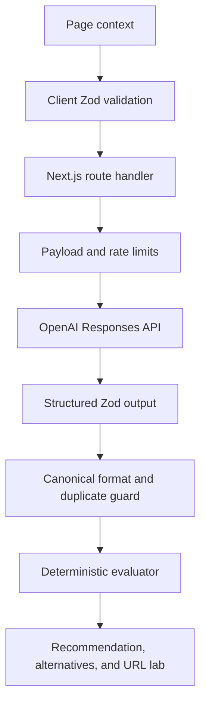

# AI SEO Slug Generator v1 — Architecture and Integration Guide

## Product outcome

This vertical slice turns the Do It With AI Tools slug methodology into a context-aware URL decision system. It deliberately solves a different problem from a conventional slugifier.

A conventional tool typically performs this transformation:

```text
a review blog for Merlin AI Chrome extension
→ a-review-blog-for-merlin-ai-chrome-extension
```

This tool treats the sentence as page context, identifies the permanent topic and intent, and can instead recommend:

```text
merlin-ai-review
```

The user receives:

1. page-type, search-intent, core-topic, and entity interpretation;
2. an explanation of which input details did not earn permanent URL space;
3. one best-overall recommendation;
4. two concise, two keyword-aligned, and two intent-led alternatives;
5. practical rationale, best-use case, and trade-off text for every candidate;
6. deterministic formatting, length, topic, filler, stability, and repetition checks;
7. an editable live URL lab with slug and full-URL copy actions; and
8. a redirect safeguard when an existing slug is supplied.

The interface does not promise a ranking, click, faster crawl, or AI citation.

## Product positioning after competitor research

The current market contains three broad patterns:

| Pattern              | Typical input                           | Typical behavior                                                    |
| -------------------- | --------------------------------------- | ------------------------------------------------------------------- |
| Mechanical slugifier | Title or sentence                       | Lowercase, remove characters, insert a selected separator           |
| Enhanced cleaner     | Title plus toggles                      | Remove stop words or numbers, cap length, return one cleaned string |
| Newer AI slug tool   | Title, keyword, page type, and controls | Generate several shorter ideas                                      |

Because a few current tools already use AI and page-type context, the public page should not claim that no contextual slug generator exists anywhere. The defensible differentiation is the complete workflow:

- one required natural-language page brief rather than a title-to-convert field;
- meaning analysis before output;
- visible compression decisions;
- a deliberately small seven-option result set;
- balanced, concise, keyword, and intent trade-offs;
- deterministic client-side quality checks; and
- an explicit published-URL migration safeguard.

## Reusable system architecture

```text
app/
├── ai-seo/slug-url-generator/page.tsx      # SEO landing page + structured data
└── api/ai-tools/slug/route.ts               # validated and protected server endpoint

components/ai-tools/
├── CopyButton.tsx                           # shared text/URL copy interaction
├── FormField.tsx                            # shared accessible field contract
└── ScoreRing.tsx                            # shared quality visualization

features/slug-generator/
├── api.ts                                   # typed browser API client
├── config.ts                                # working limits and group copy
├── evaluator.ts                             # deterministic slug analysis
├── prompt.ts                                # server-side context/compression method
├── schema.ts                                # one Zod source for input/output/types
├── types.ts                                 # evaluated candidate type
└── components/
    ├── SlugGeneratorClient.tsx              # request state and orchestration
    ├── SlugGeneratorForm.tsx                # one-required-field page brief
    ├── SlugResults.tsx                      # interpretation and result workspace
    ├── SlugCard.tsx                         # candidate explanation and selection
    ├── SlugLab.tsx                          # editable URL preview and checks
    └── SlugToolEducation.tsx                # indexable supporting page content

lib/ai-tools/
├── openai.ts                                # shared provider and model routing
└── rate-limit.ts                            # reusable per-tool rate limits
```

## Request flow



The model performs semantic work:

- infer page type and search intent;
- identify the primary entity and stable concepts;
- distinguish essential intent cues from headline clutter;
- generate genuinely different candidates; and
- explain compression decisions and trade-offs.

Application code performs deterministic work:

- lowercase and hyphen normalization;
- word and character counts;
- URL-safe format validation;
- meaningful primary-keyword token coverage;
- page-context token alignment;
- obvious filler-word detection;
- repeated-token detection;
- evergreen date and freshness risk;
- current-slug similarity; and
- the live quality score and checks.

This AI/software boundary is reusable across future tools: language judgment belongs to the model, while counts, syntax, validation, and visible rules belong to code.

## Lightweight input contract

Only page context is required.

| Input                 | Why it exists                                | Sent to model |
| --------------------- | -------------------------------------------- | ------------- |
| Page context          | Defines the real page, coverage, and outcome | Yes           |
| Primary keyword       | Preserves researched terms when available    | Yes           |
| Current or draft slug | Supports improvement and migration warning   | Yes           |
| Parent URL            | Creates a realistic preview                  | No            |
| Time-sensitive switch | Permits an essential year or temporary angle | Yes           |

The form does not ask the user to choose separators, capitalization, arbitrary maximum lengths, tone, audience sophistication, or search intent. Hyphens and lowercase are fixed technical decisions; page type and intent are inferred from context.

## Structured generation contract

The endpoint uses the official OpenAI JavaScript SDK, the Responses API, and Structured Outputs through `zodTextFormat`.

- Default model: `gpt-5.6-luna`
- Reasoning effort: `low`
- Maximum output: 3,500 tokens
- Candidate count: exactly seven
- Alternative sets: exactly two concise, two keyword-aligned, and two intent-led
- Server checks: schema adherence, canonical normalization, and duplicate word-set rejection

The model can be changed through `OPENAI_SLUG_GENERATOR_MODEL` without editing application code.

## Prompt and input safety

- The OpenAI key stays server-side.
- The route rejects payloads larger than 20 KB.
- Zod trims and length-limits every input field.
- User fields are serialized as JSON source data.
- The system prompt explicitly rejects instructions embedded inside the brief.
- The parent URL is used only on the client and is not sent to the model.
- Raw page briefs are not intentionally written to application logs.
- Errors return safe public messages while technical failures stay in server logs.
- Responses use `Cache-Control: no-store`.

## Rate-limit reuse

The earlier meta-title-specific limit logic is generalized as:

```ts
checkAiToolRateLimit(request, toolId);
```

Each tool receives separate daily and burst windows while reusing the same hashed client key and Redis/in-memory implementation. The compatibility wrapper `checkMetaTitleRateLimit()` remains, so the earlier endpoint does not break.

## URL best-practice policy

The public claims follow a conservative hierarchy:

### Official Google guidance represented directly

- use simple, descriptive words instead of unreadable IDs when possible;
- use the audience's language;
- use hyphens rather than underscores to separate words;
- shorten unnecessary parameters; and
- remember that URL paths can be case sensitive, which supports consistent lowercase conventions.

### Do It With AI Tools editorial heuristics

- prefer three to five meaningful words;
- use one primary topic or keyword phrase;
- remove filler only when meaning remains clear;
- keep intent cues only when they distinguish the page;
- avoid dates for evergreen pages; and
- treat the slug as a stable identifier chosen before publishing.

The interface and FAQ clearly describe three to five words as a working target, not a fixed Google rule.

## Published URL safeguards

This is primarily a new-page generator. When `currentSlug` is present, the results show a migration warning.

If a published URL changes, the implementation guide tells the site owner to:

1. confirm that the strategic benefit justifies the risk;
2. create a permanent redirect from the old URL to the new URL;
3. update internal links;
4. update the canonical URL;
5. update XML sitemaps; and
6. monitor crawling, indexation, and traffic after release.

The tool does not automate redirects or imply that a changed slug is harmless.

## SEO page architecture

The server-rendered landing page includes:

- a unique title, description, canonical, Open Graph, and Twitter configuration;
- `WebApplication`, `BreadcrumbList`, and `FAQPage` JSON-LD;
- a clear distinction from mechanical slugification;
- the methodology and quality checks built into the tool;
- a four-step workflow;
- ranking and AI-visibility limitations;
- a published-URL boundary;
- FAQs; and
- contextual links to `/ai-seo/write-slug-urls`.

Generated results remain in client session state. The build does not create indexable result URLs.

## Analytics event plan

Analytics is deliberately not hardwired in v1. Add events later through one shared adapter:

| Event               | Trigger                    | Safe parameters                           |
| ------------------- | -------------------------- | ----------------------------------------- |
| `ai_tool_started`   | Valid brief submitted      | `tool`, `has_keyword`, `has_current_slug` |
| `ai_tool_completed` | Structured result received | `tool`, `model`, `remaining`              |
| `ai_tool_failed`    | Public request error       | `tool`, `error_code`                      |
| `slug_copied`       | Candidate slug copied      | `group`, `score`, `words`                 |
| `slug_selected`     | Candidate opened in lab    | `group`, `score`                          |
| `slug_edited`       | Live lab value changed     | `source_group`                            |
| `guide_clicked`     | Methodology CTA clicked    | `placement`                               |

Do not send page briefs, keywords, generated slugs, current URLs, IP addresses, or other user-entered text to GA4.

## Validation and rollout gates

Before public release:

1. run the complete AI-tool test suite;
2. run TypeScript validation and a production Next.js build;
3. visually test 320, 375, 768, 1,024, and 1,440 px widths in light and dark modes;
4. test empty, minimum, maximum, unrelated, multilingual, commercial, product, service, and time-sensitive briefs;
5. test missing key, refusal, timeout, malformed output, duplicate output, and rate-limit states;
6. evaluate at least 30 real briefs and compare suggested slugs with expert human choices;
7. compare Luna and Terra for accuracy, variety, latency, and cost;
8. verify that no candidate invents an unsupported keyword, feature, location, or claim;
9. configure shared Redis limits before advertising; and
10. add article-to-tool and hub-to-tool internal links.

## Primary research used

- Do It With AI Tools, “How to Write the Perfect Slug URL for SEO Rankings, AI Visibility and Maximum User Engagement”: <https://doitwithai.tools/ai-seo/write-slug-urls>
- Google Search Central, “URL Structure Best Practices for Google Search”: <https://developers.google.com/search/docs/crawling-indexing/url-structure>
- OpenAI Docs, “Structured model outputs”: <https://developers.openai.com/api/docs/guides/structured-outputs>
- Slugify.online, URL Slug Generator: <https://slugify.online/>
- Junia AI, AI Slug Generator: <https://www.junia.ai/tools/slug-generator>
- PikaSEO, URL Slug Generator: <https://pikaseo.com/free-tools/slug-generator>

## Deliberately deferred from v1

- fetching or crawling a supplied page URL;
- sitemap-wide slug audits;
- bulk CSV generation;
- multilingual transliteration controls;
- competitor-SERP or keyword-volume APIs;
- user accounts, saved projects, and history;
- automated CMS updates and redirect creation;
- analytics implementation;
- email capture; and
- payment or credit systems.

These can be evaluated after real usage confirms that the context-to-slug decision workflow is useful.
