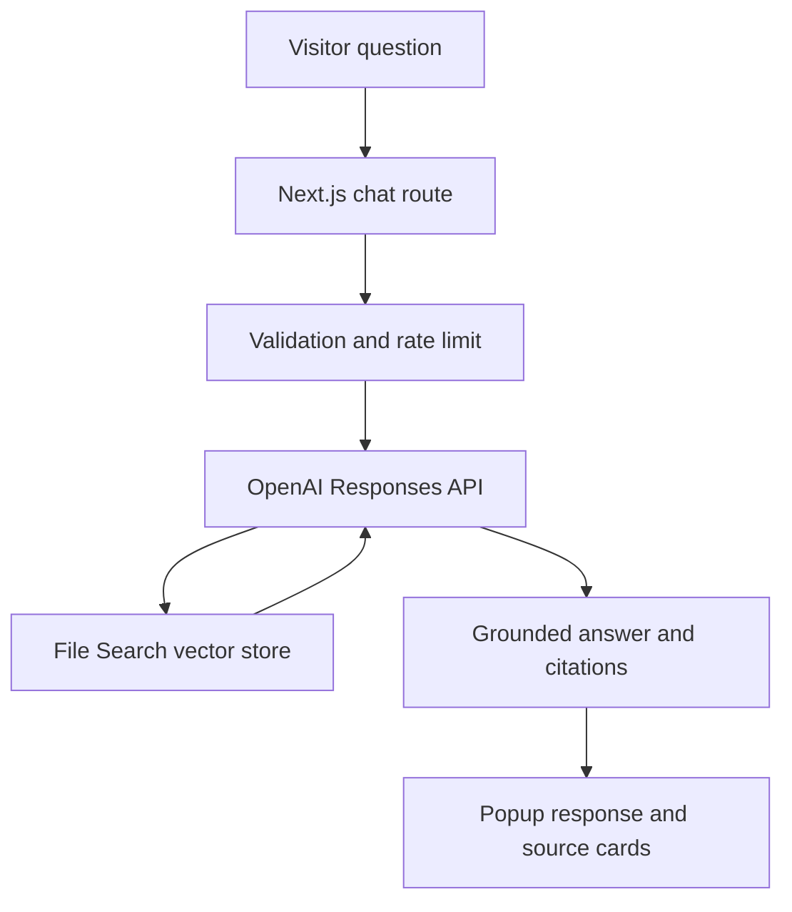
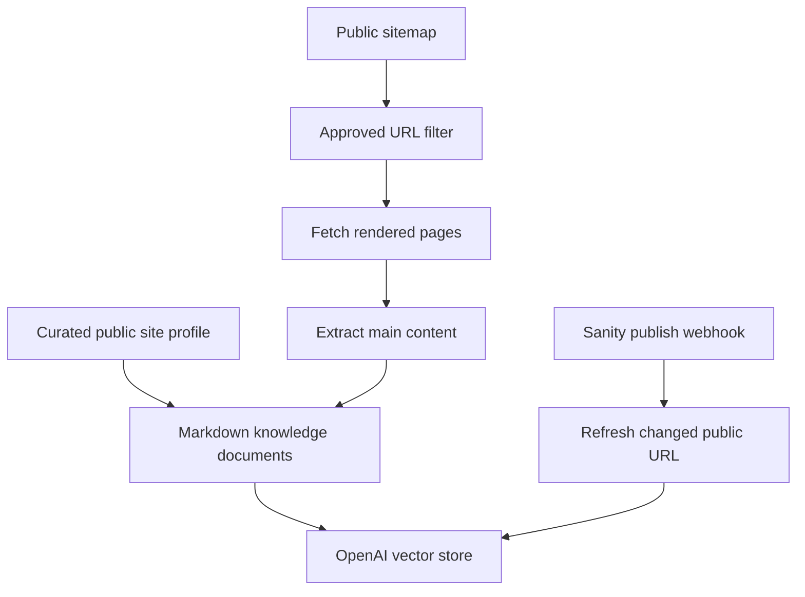

# Do It With AI Tools Site Assistant Architecture

## Product decision

This is a website knowledge assistant, not a general ChatGPT clone. Its primary jobs are to answer from published Do It With AI Tools content, help a visitor find the best page or resource, explain supported AI SEO topics, and route contact or collaboration enquiries.

The v1 implementation uses OpenAI's managed File Search because the current corpus is small, it removes the need to operate a separate embedding pipeline or vector database, and it still exposes the retrieved results needed for visible source cards.

## Runtime flow

No API secret is present in browser JavaScript. The public interface only calls the server route.

## Knowledge synchronization

The crawler accepts only the configured Do It With AI Tools host, follows at most three validated redirects, rejects API and studio routes, rejects binary/document extensions, enforces response-size and timeout limits, and strips scripts, forms, navigation, and footer chrome before indexing.

## Why rendered public pages are the source

The site already renders Sanity content into canonical public pages and publishes those pages in a sitemap. Indexing that output provides several benefits:

- no manual article export or copy-paste process;
- no direct Sanity token or private dataset access in the synchronization script;
- the assistant sees what a visitor can actually read;
- articles and supporting static pages use the same ingestion pipeline;
- the crawl cannot accidentally include unpublished drafts.

If future content becomes client-only and is absent from the initial HTML, the next evolution should query Sanity with a read-only token and convert Portable Text deterministically. That is not required for the current rendered site.

## Knowledge sources

| Source                | Inclusion method                               | Update method                |
| --------------------- | ---------------------------------------------- | ---------------------------- |
| Published articles    | Sitemap plus public page extraction            | Sanity webhook and full sync |
| Hub/listing pages     | Essential path list plus sitemap               | Full sync                    |
| Contact and FAQ       | Public page extraction                         | Full sync                    |
| Author details        | Public author/about pages plus curated profile | Full sync/config update      |
| Free AI Resources     | Public page extraction                         | Webhook/full sync            |
| Technology background | Curated, explicitly public facts               | Config update/full sync      |
| Social links          | Curated verified links                         | Config update/full sync      |

Private drafts, CMS credentials, analytics, visitor form submissions, unpublished files, and internal environment variables are outside the knowledge boundary.

## Answer policy

The system prompt requires retrieval for every answer and establishes this priority:

1. Answer directly when retrieved site knowledge supports the response.
2. Recommend a small number of relevant internal pages.
3. Say the answer cannot be confirmed when evidence is missing.
4. Route appropriate enquiries to the verified contact page/email.
5. Decline unrelated general-purpose questions and return to the site's domain.

SEO, schema, AEO, GEO, traffic, rankings, and AI citations are presented as practices and heuristics—not guarantees.

## UI behavior

The popup is mounted in the root layout and therefore appears across the application. It contains:

- a static initial welcome message that costs no API call;
- four quick-start questions;
- persisted messages for the current browser tab session;
- loading, error, reset, minimize, and accessible labeling states;
- verified source cards linking only to Do It With AI Tools pages;
- a non-shrinking composer and independently scrollable message area;
- mobile safe-area handling and a full-width small-screen layout.

## Security and reliability controls

| Risk                         | Control                                                           |
| ---------------------------- | ----------------------------------------------------------------- |
| Secret exposure              | OpenAI key is server-only                                         |
| Prompt injection in articles | Retrieved content is explicitly untrusted reference material      |
| Cross-site crawling/SSRF     | Fixed origin allowlist, validated redirects, excluded routes      |
| Oversized requests           | Zod limits per message, conversation length, and total characters |
| Cost abuse                   | Daily and burst limits, retrieval cap, output-token cap           |
| Fabricated source links      | Server allowlists and deduplicates source URLs                    |
| Stale content                | Incremental Sanity sync plus full reconciliation command          |
| Publishing outage            | Chatbot refresh failure never blocks CMS cache invalidation       |
| UI composer disappearing     | Fixed flex panel with scroll isolated to transcript               |

## Reusable boundaries

The feature is separated into five layers:

| Layer            | Location                                       | Responsibility                                    |
| ---------------- | ---------------------------------------------- | ------------------------------------------------- |
| Presentation     | `features/site-assistant/components`           | Popup, transcript, sources, composer              |
| Client transport | `features/site-assistant/api.ts`               | Safe browser request wrapper                      |
| API boundary     | `app/api/ai-assistant/chat`                    | Validation, limits, error contract                |
| Answer engine    | `features/site-assistant/server/chat.ts`       | Prompt, File Search, response/source extraction   |
| Knowledge engine | `features/site-assistant/server` and `scripts` | Crawl, extraction, vector-store sync, CMS updates |

This separation makes it possible to replace managed File Search with pgvector later without rebuilding the widget or public API contract.

## Recommended evolution after v1 evidence

1. Add explicit thumbs-up/down feedback without recording message text in analytics.
2. Add a reviewed unanswered-query dashboard with privacy controls.
3. Add consent-based lead capture as a server tool, not free-form chat text.
4. Add human support escalation and newsletter subscription only after authentication/permission rules are defined.
5. Consider a self-hosted retrieval layer only if scale, cost, data residency, or ranking control justifies the additional infrastructure.
