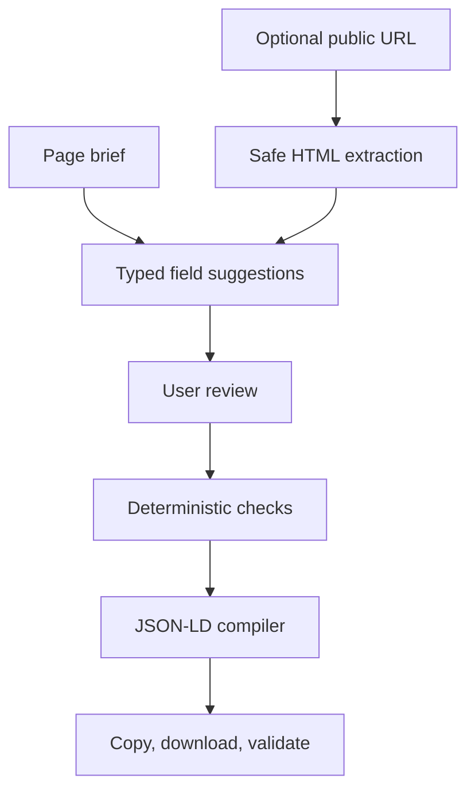

# Schema Markup Generator Architecture

## Product decision

This tool is not a prompt wrapper and not a single generic form. It is a typed structured-data engine with three distinct responsibilities:

1. **Evidence layer** — user brief and optional safe URL extraction.
2. **Suggestion layer** — optional structured AI extraction into known field IDs.
3. **Authority layer** — deterministic TypeScript validation and JSON-LD compilation.

The model never receives authority to fabricate or publish final schema.



## Schema registry

`config.ts` is the source of truth for the user-facing workflow:

- schema label and Schema.org type;
- current support status;
- use-case guidance and warnings;
- sections;
- scalar field definitions;
- repeater definitions;
- required and recommended flags;
- select options;
- a complete example fixture.

The form renders the registry. The validator reads the same registry. This avoids separately maintained UI and required-field lists.

## Supported type matrix

| Workflow       | Primary type                            | Current tool status                          |
| -------------- | --------------------------------------- | -------------------------------------------- |
| Article        | `Article`, `BlogPosting`, `NewsArticle` | Google-supported                             |
| FAQ            | `FAQPage`                               | Google display restricted                    |
| Breadcrumb     | `BreadcrumbList`                        | Google-supported                             |
| How-to         | `HowTo`                                 | Schema.org valid; Google rich result retired |
| Product        | `Product`                               | Google-supported                             |
| Recipe         | `Recipe`                                | Google-supported                             |
| Event          | `Event`                                 | Google-supported                             |
| Job            | `JobPosting`                            | Google-supported                             |
| Local business | specific `LocalBusiness` subtype        | Google-supported                             |
| Organization   | specific `Organization` subtype         | Google-supported                             |
| Person         | `Person`                                | Schema.org entity markup                     |
| Video          | `VideoObject`                           | Google-supported                             |
| Website        | `WebSite`                               | Google site-name signal                      |
| Software       | `SoftwareApplication`                   | Google review feature support                |
| Course         | `Course`                                | Schema.org valid; Google support changed     |
| Service        | `Service`                               | Schema.org entity markup                     |

Schema.org contains hundreds of additional types. V1 intentionally covers high-value page types from the Do It With AI Tools methodology plus Event and JobPosting. New workflows should be added only with an official requirements review, compiler support, conditional validation, example fixture, and tests.

## State model

```ts
type SchemaFormState = {
  schemaType: SchemaTypeId;
  pageUrl: string;
  pageContext: string;
  values: Record<string, string | boolean>;
  repeaters: Record<string, SchemaRepeaterItem[]>;
  includeWebPage: boolean;
  includeBreadcrumbs: boolean;
  breadcrumbs: SchemaRepeaterItem[];
  visibleContentConfirmed: boolean;
};
```

The generic state keeps the rendering layer reusable. Type-specific meaning stays in the registry, compiler, and conditional validator.

## Compiler behavior

`compiler.ts`:

- maps every supported workflow to explicit Schema.org objects;
- uses canonical URLs to create stable fragment IDs;
- generates an `@graph`;
- optionally adds a WebPage node with `mainEntity`;
- optionally adds and connects a BreadcrumbList;
- nests offers, ratings, reviews, authors, publishers, addresses, locations, instructions, and other properties under the correct entity;
- converts selected enumerations to full Schema.org URLs where appropriate;
- removes empty strings, empty arrays, empty objects, `null`, and `undefined` while preserving meaningful `0` and `false` values;
- escapes `<` in serialized JSON to reduce script-context injection risk;
- produces both a raw `.jsonld` document and a ready-to-paste HTML script.

## Validation behavior

`validation.ts` produces a readiness score, not an SEO score. The score reflects field completeness and tool checks only.

Global gates:

- canonical absolute page URL;
- meaningful page context;
- visible-content confirmation;
- required field completion;
- required repeater item completion;
- absolute URL formatting.

Conditional examples:

- Article publication and modification date order;
- Product/Recipe rating value and count pairs;
- physical, virtual, and mixed Event location rules;
- remote JobPosting applicant regions;
- non-remote JobPosting address;
- salary min/max order, currency, and unit;
- latitude/longitude pairs;
- VideoObject `contentUrl` or `embedUrl`;
- current Google support warnings.

External validators remain mandatory because this application does not reproduce the complete evolving Schema.org vocabulary validator or Google’s private eligibility systems.

## AI analysis contract

The API uses OpenAI Responses with Zod Structured Outputs. It returns:

- suggested primary workflow;
- confidence and rationale;
- a bounded array of `{ fieldId, value, evidence }` suggestions;
- warnings;
- extracted high-level page metadata.

The server filters every scalar field ID and indexed repeater path against the currently selected registry before returning the response. Paths such as `faqs.0.question` can populate reviewed nested rows without giving the model authority over the final JSON-LD shape. The client applies suggestions and resets visible-content confirmation, forcing another human review.

The prompt treats fetched page content and existing JSON-LD as untrusted evidence. It explicitly forbids invented dates, prices, ratings, identifiers, locations, and credentials.

## URL-fetch security

`server/fetch-page.ts` is Node-only and is never bundled into the client.

Controls:

- HTTP/HTTPS allowlist;
- credential rejection;
- standard-port allowlist;
- localhost and local-domain rejection;
- DNS resolution before fetch;
- IPv4 and IPv6 private/reserved range blocking;
- redirect-by-redirect validation;
- three-redirect limit;
- 10-second timeout;
- 1.25 MB body cap;
- HTML content-type requirement;
- bounded 14,000-character visible-text excerpt;
- no user cookies, authorization, or custom headers.

For higher-security deployments, route outbound fetches through a dedicated egress proxy that pins DNS resolution, enforces domain/IP policies, and logs every target.

## External testing strategy

The old Google Structured Data Testing Tool is retired. Current actions are deliberately separated:

- **Schema.org Validator** — broad vocabulary and syntax.
- **Google Rich Results Test** — current Google search feature eligibility.
- **Live URL testing** — verifies the published page, rendering, accessibility, and deployed markup.
- **Code testing** — verifies the draft snippet before deployment.

Because Google does not document a stable third-party code-prefill API, the tool copies the snippet and opens the official code-testing workflow. It does not depend on fragile private request parameters.

## Adding a new schema workflow

1. Confirm the type and properties on Schema.org.
2. Check whether Google currently documents a corresponding search feature.
3. Add the definition, status, fields, repeaters, guidance, and sample to `config.ts`.
4. Add an explicit compiler branch.
5. Add conditional integrity rules.
6. Add a fixture test that must have zero tool errors.
7. Test the output in Schema.org Validator and, where applicable, Google Rich Results Test.
8. Update the public type matrix and FAQ only after validation.
